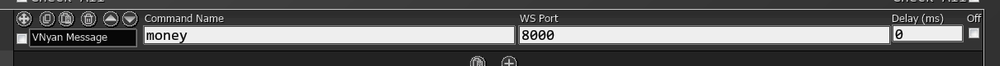
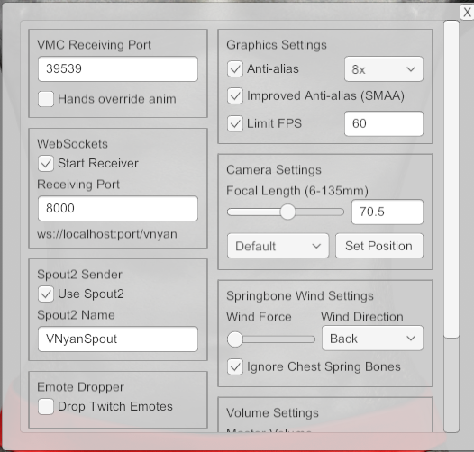
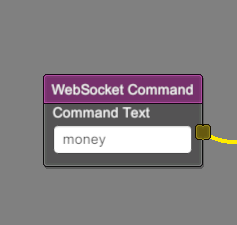
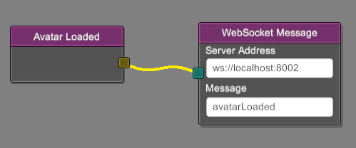
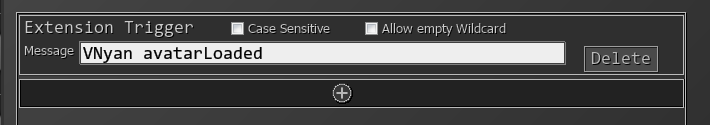

# vnyan-sammi-extension
SAMMI extension for vnyan

# Installation
** PLEASE NOTE. AS OF 1.0.0 ONWARD, YOU WILL NEED NODE INSTALLED IF YOU WANT TO HAVE THE TRIGGERS WORK **

** AS OF 2.0.0, YOU NEED TO BE ON WINDOWS 10 OR LATER FOR THE INSTALLATION PROCESS TO WORK**

Inside of Sammi, on the left select bridge. Select install new extension. Install vnyan-sammi-extension.sef.

There will be a new deck with a big red button. Run this button twice.

Then restart sammi.

# Usage 
## Sending Data to VNyan
If you installed the extension correctly, you'll now see the `VNyan Message` command as an option. 

The Command Name is what will be sent to Sammi. The WS port is the port of the websocket receiver used in VNyan.

You can find this port by going to the general settings of VNyan. Make sure you enable the receiver.

Lastly, the Command Name will be a websocket node inside of Vnyan.

## Receiving Data from VNyan
As of 1.0.6 VNyan can SEND websocket messages. This is great if you want to have something inside sammi happen for example when the avatar gets loaded.

First you'll need to set up the WebsocketMessage node. This will always need to be `ws://localhost:8002`. For the message you can define whatever you'd like.

To set up the trigger inside of sammi, you'll need to use an Extension trigger. It'll just be `VNyan` followed by your message.

# Troubleshooting
If you have no intention of having vnyan send information to sammi, and you don't want to see the error message of it trying to reconnect, disable the triggers for the `Startup` button in the deck that was created. 

* Did you install node?
* Does the path to your folder have spaces in it? If so please remove.
* Did you press the big red button twice?
* Is the websocket receiver turned on?
* Is the port number correct?
* Is the command name spelled correctly?
* make sure that `node-modules` exists in the `vnyan-sammi-extension` folder (inside your sammi folder). If it doesn't run `npm i`.

# Contact
https://www.twitch.tv/swolekat

# Technical notes
In version 1.0.6 VNyan introduced a websocket callback node. Unfortunately since the sammi plugin is also a client, there's no way to have them talk to eachother directly. Instead, we need to have a very small node service running in the background that proxies the websocket messages betweent the two. 
